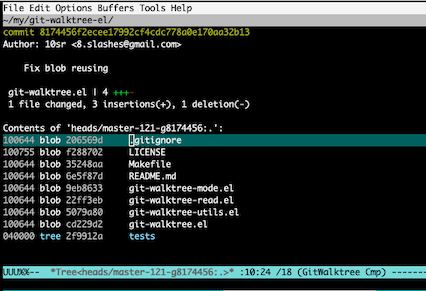

git-walktree.el
===============

Browse Git tree and blob objects

What is This?
-------------

`git-walktree` is a Git `ls-tree` browser.
It has following features:

- Browse tree (and blob) objects of arbitrary revisions
  without checking them out to working directory
  - Go up and down tree objects
  - Visit blob objects
  - Switch to parent and child revisions
- Checkout (dump) tree or blob objects to current working directory

Usage and Keybinds
------------------

<kbd>M-x git-walktree</kbd> to open git-walktree buffer.
Prompt user for revision to show.

- When current buffer is visiting a file and it exists in the revision,
  open blob buffer for that file
- Otherwise, open tree buffer for `default-directory`

In git-walktree buffers, following keybinds are defined:

- <kbd>^</kbd> Go up to parent tree object
- <kbd>P</kbd> Switch to parent revision
- <kbd>N</kbd> Switch to child revision
- <kbd>C</kbd> Checkout current blob or tree object to working directory
- <kbd>G</kbd> Switch to another revision (ask user)

Additionally, in tree object buffer:

- <kbd>ENTER</kbd> Visit tree or blob object at point

License
-------

This software is released under GPL version 3 or (at your option)
any later version.

See `LICENSE` for details.
